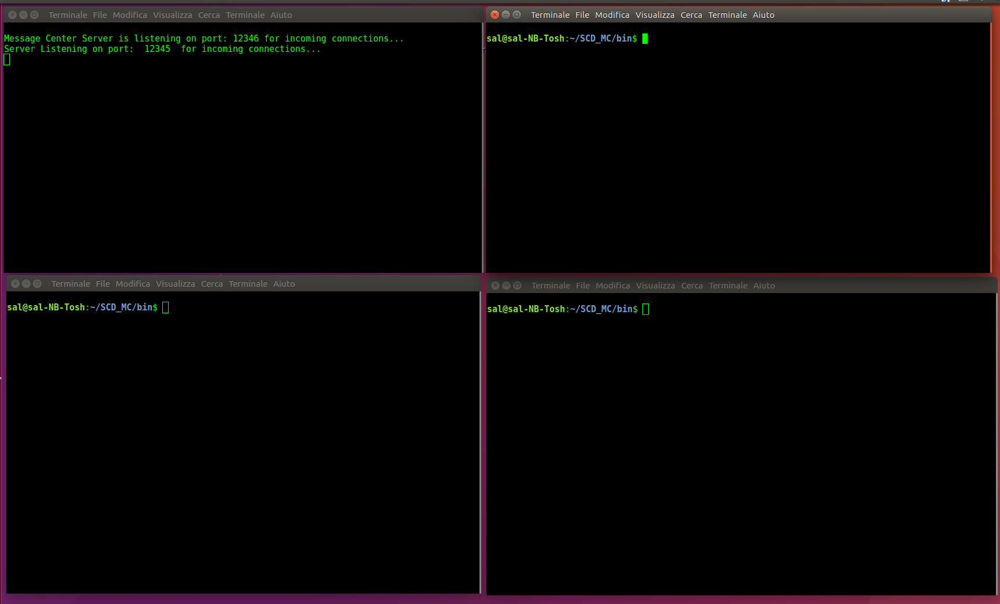
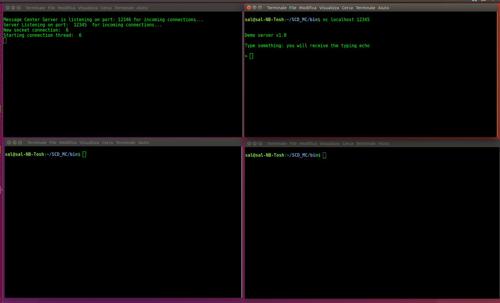
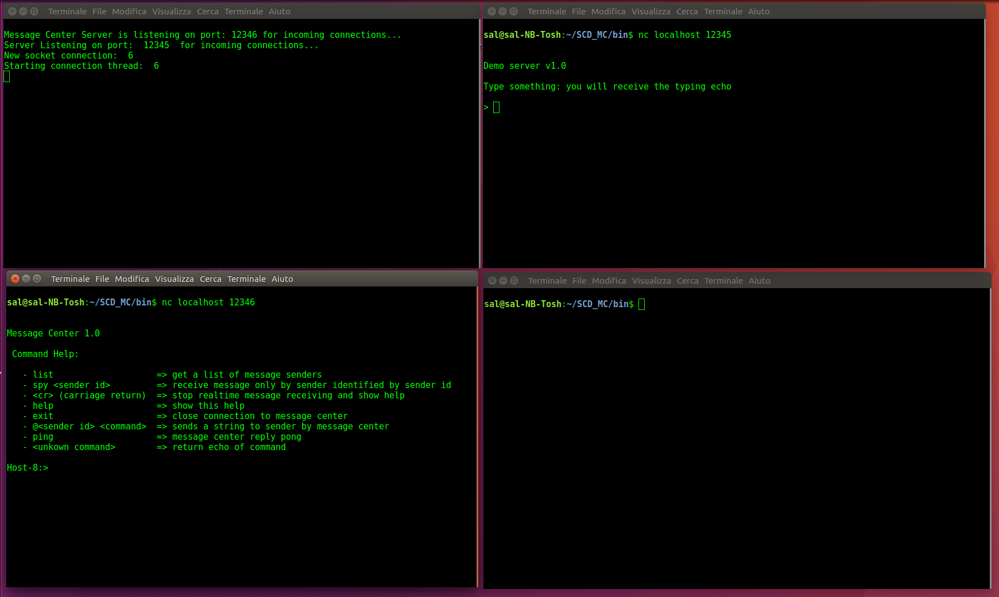
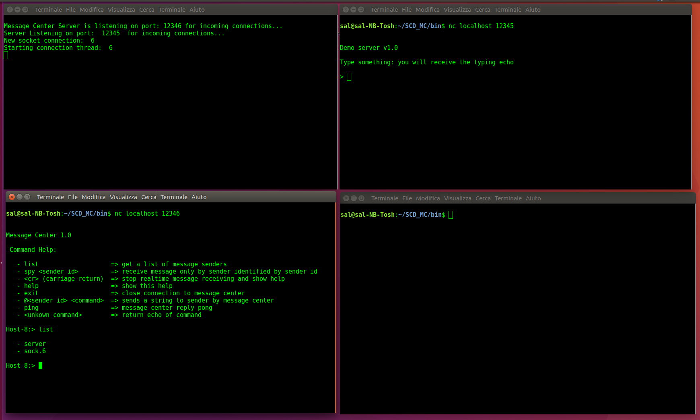
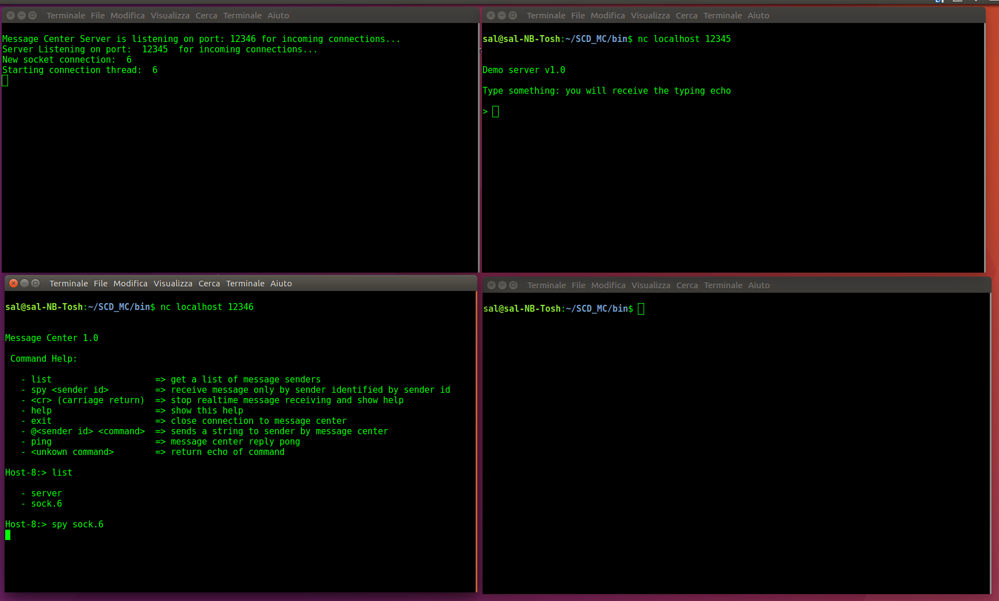
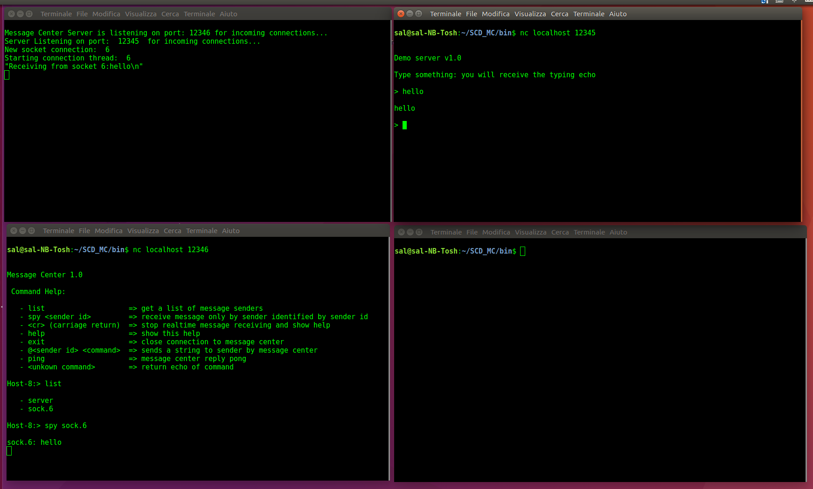
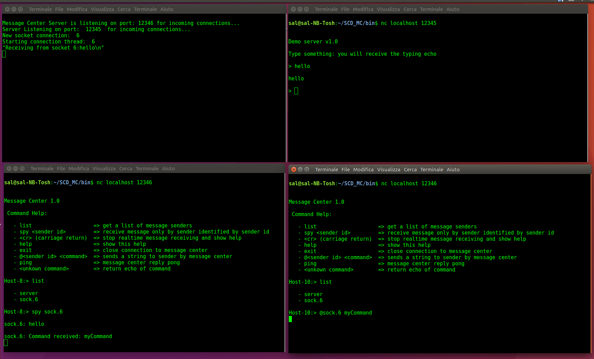

# SCD Message Center (QT C++ Class)

## Description
SCD Message Center is a Qt interprocess communication class.<br>
The purpose of the Message Center is to allow the exchange of messages between your own multithreading application and one or more remote control-monitoring terminals via TCP socket. <br>
This Qt class can be used also for generic interprocess communication through message exchanging.<br>
This class can be easily integrated into your application, it works very well and it's truly reliable
## What you can do with the SCD Message Center
By embedding the SCD Message Center into your own application you will be able to:

- Realtime monitoring  of your own application by receiving messages from each thread of your application via tcp Socket, such as log messages, variable values, event messaging etc.
- Send commands to the message center to get status information or request the execution of actions to your application threads
- Send custom commands to each thread of your application for performing custom actions, such as disconnecting a client, terminating a thread, changing the value of variables, etc.

## When is it useful to use the message center?
The typical use of the message center is the realtime remote monitoring and control of a multi-threading application.<br>The message center can also be used for remote debugging in real time by controlling variable values, and modifying their value, for example. A very interesting use could be, if the host application allows it, the execution of system commands or the execution of processes.
## Message Center Architecture

The Message Center is a message and command exchange center.<br><br>
It consists of two parts:

- The Multithreading Socket Server to accept remote client connections
- The Message center to serialize and exchange message/commands between application thread (sender) and remote clients (commands clients)

<p align="center"><b>Fig. 1 - Integration of the message center into a really realized multi-thread audio streaming server</b></p>
The main task of the Message Center is to serialize the requests (Commands and messages) and route its to destination threads as below explained (see fig. 1):</p>

- The remote client sends a comand to Message Center (TCP CLient 3, at left in figure). 
- The message Center routes it to application destination thread (Thread id=3, at right in figure). 
- The destination thread (Thread id = 3) sends a reply message to Message Center which route it to remote client (TCP CLient 3) which have emitted the command.
- The application threads send messages (as a log message) to Message Center (Thread id=1,2 at right in figure)
- The remote clients (TCP Client 1,2) request to Message Center to receive messages from a specific theread (Thread id=1)
- The Message Center routes messages from application thread (Thread id=1) to remote clients which have requested to receive it (TCP Client 1,2)
- The Message Center discards the messages of application threads (Thread id=2) which are not be request from any remote client
- The TCP Client 4 in figure 1 instead, simply send a command to Message Center (as a request of console menu) and Message Center send to it the reply

The Message Center clients can send command to:

- the Message Center to receive status message or command menus, 
- a thread of remote application via Message Center (for example to request to execute a specific action).

The Remote clients connects to Message Center via TCP socket. You can connect to message center using a TCP socket client terminal as netcat (nc) or telnet, or your own TCP socket client application.

## How To it Work

To use Message Center you must embed message center source code it into your own multitheread application QT project, and start Message Center TCP Server on a specific port. When the message center server is started, it can accept tcp socket connection from a remote client application as nectat (nc).<br>
To allow the message center to monitoring your application, you must follow two step:
 
- The application threads register some senders into message center to self identifying. Doing this, the message center clients can request list of senders id registered to message center, and therefore can request to receive message identified by centain sender id.
- The application threads sends real-time messages identify by an registered sender id: the messages will real-time dispatched to clients which request to receiving messages from the same sender id, otherwise the messages will be discarded by Message Center.

When the clients connect to message center server, they receive the  commands menu, and a command line prompt waiting for commands typing.

To receive messages from remote application theread, the message center clients can:
 
- request list of senders id registered to message center
- request to receive message from specific sender id (if already known): the thread monitoring starts immediately and the client begins to receive messages real-time
- to stop the-realtime thread monitoring the user can press enter to return to console 

## How to install and compile: demo example with complete project source code

- Download or clone project. To clone project, at prompt type:
```
$ git clone https://github.com/sc-develop/SCD_MC.git
```
- If you have downloaded the repository, unzip project folder on your develop folder
- Run qt creator (5.9.2 or later) and load project file ‘message-center-demo.pro’ located into folder ‘source’
- Build project and run 
- Alternatively you can make executable from cli (you must before install q5-default on your linux system):

``` 
$ cd <SC_MC source dir>
$ ./make-release.sh  
```
or
```
$ ./make-debug.sh
```
## Embedding Message Center into your own application source code

You must include into your own project all package files:
```
#include msgcenter.h
#include msgcenter.cpp
#include msgserver.cpp,
#include msgserver.h,
#include msgserverthread.h,
#include msgserverthread.cpp,
#include msgthreadhandler.h
#include msgthreadhandler.cpp
```
In your main() function/class declare message center server and start it (message center is sef allocated):
```
int main(int argc, char *argv[])
{
   QCoreApplication a(argc, argv);
   . . .
   int mcport = 123456; 
   SCDMsgServer msgServer(mcport,true);  // declare message center server
   msgServer.start(); // start message center server: message center is self allocated by messge server   
   SCDMsgCenter *mc = msgServer.messageCenter(); // get self allocated message center pointer
   myMainClass(mc);    // pass message center pointer to application main class
   . . . 
   return a.exec();   // start application main event loop
}
```

It is strictly recommended to use the self-allocated message center, becose it is already self-connected to message center server. 

You can get it from message server by:
```
SCDMsgCenter *mc = msgServer.messageCenter(); 
```	
You can use this message center in every part of your sigle/multi-threaded application. 
You shuld passing it as a parameter to all classes or functions that will make use of it. 
You have to pass it to all the threads will use it.
```
MyThread *= new myThread(mc,...);
```
On thread main loop you should: 

- Register thread sender: 
- Use PostMessage method to send message to message center
```
void myThread::run() // qt thread main loop
{
   Qstring  threadSenderName = “Thread[1]”;

   mc->addSender(threadSenderName);        // register a new sender to message center

   QString msg = “Welcome to thread loop”;  

   mc→postMessage(msg,threadSenderName);   // send message to message center

   . . .

   exec(); // exec qt thread event loop

   QString msg = “Thread loop has finished...”;  
 
   mc→postMessage(msg,threadSenderName);   // send message to message center 
}
```

<b>Implementing execution of remote clients command</b><br><br>
Execution of remote clients command must be implemented by application developer<br>
When Message Center client sends a command to specific thread, Message Center emit a signal

```
emit commandToSender_signal(command,sender_id);
```

This signal must be processed by application threads event loop.<br>

In your class that processes thread signals/event (must be live into thread space) create the slot as in demo example
```
void SignalsHandler::onClientCommand(QString cmd, QString sender)
{
   if (sender==socket->objectName())
   {
       mc->postMessage("Comand received: " + cmd,socket->objectName());
   }
}
```
and connect the signal to slot, in the constructor for example
```
connect(mc,SIGNAL(commandToSender_signal(QString,QString)),this,SLOT(onClientCommand(QString,QString)));
```

<b>N.B.</b>
Only the specified destination thread (sender param) should process the message.

## Testing the Application
Run the Message Center Demo Application, and open three terminals.<br><br>

Run application tcp client on port 12345<br><br

Run Message Center tcp client on port 12346: the Message Center send it the command menu and it wait for typing<br><br

Digit the command 'list' to abtain the list registerd sender<br><br 

Digit the command 'spy sock.6' the terminal enter in mode 'realtime monitoring' all messages set from application cleint to Application Server will be shown on remote monitoring client<br><br




